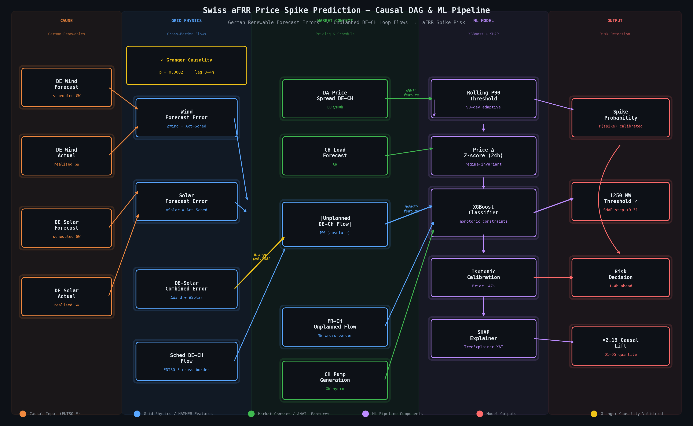
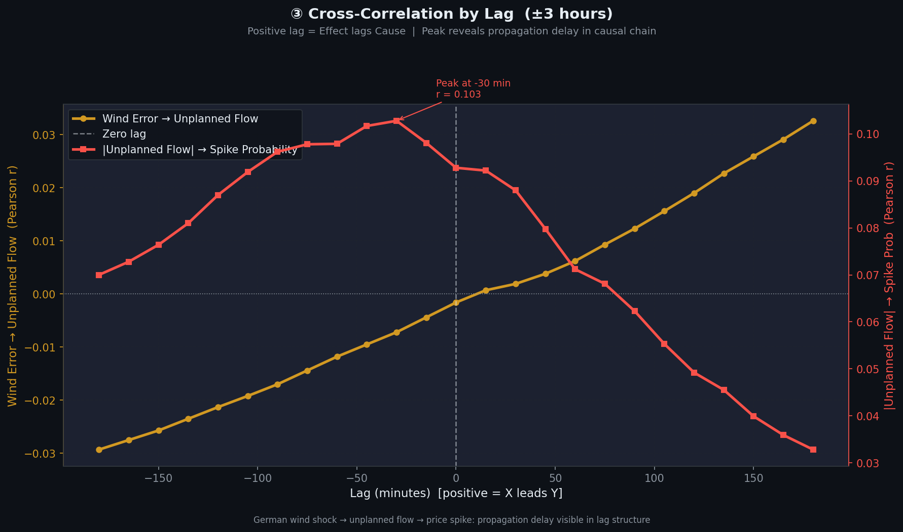
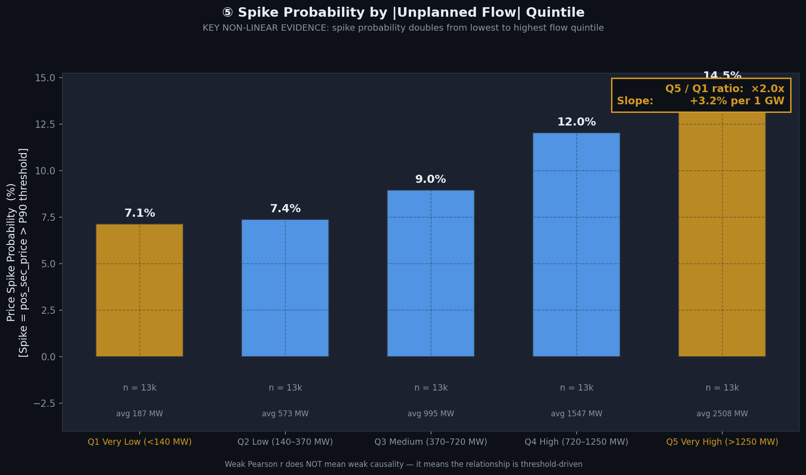
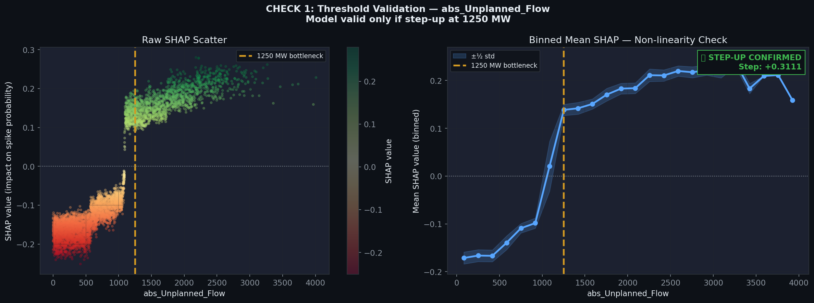
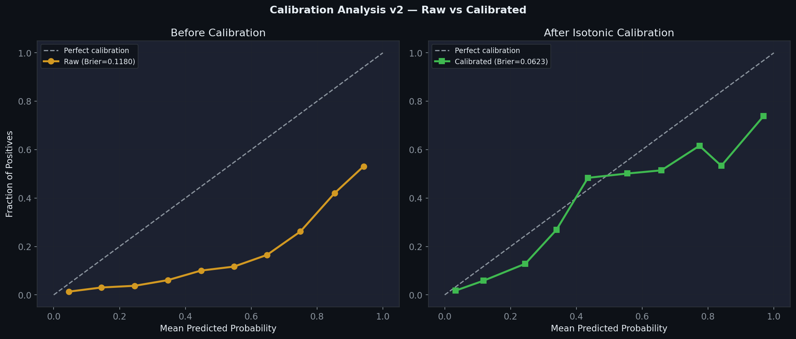

# Swiss aFRR Price Spike Prediction
### Causal ML for Cross-Border Energy Flow Anomaly Detection

A production-grade machine learning project that identifies the physical mechanism behind Swiss secondary reserve (aFRR) price spikes, validates it causally, builds a calibrated risk detection model, deploys it as an automated daily prediction pipeline with 3-layer anomaly detection, and benchmarks against modern AI methods (TimesFM, Prophet, local LLMs).

---

## The Problem

Swiss aFRR (automatic Frequency Restoration Reserve) prices exhibit sudden spikes that are costly for market participants. The standard assumption is that these spikes are driven by domestic demand-supply imbalances. This project tests a different hypothesis:

> **German renewable forecast errors cause unplanned loop flows across the DE-CH border. When these flows exceed the physical grid bottleneck at ~1250 MW, Swiss balancing costs spike non-linearly.**

---

## Key Findings



### Finding 1 — Causal Chain Validated
Granger causality test confirms that `DE_WindSolar_Error` causes `abs_Unplanned_Flow_DE_CH` at **p = 0.0082** (lag 3-4h). The German wind forecast error today predicts Swiss grid stress 3-4 hours later.

### Finding 2 — Non-Linear Physical Threshold
Spike probability **doubles (×2.19x)** when unplanned DE-CH flows exceed **1,250 MW** — the physical bid-ladder bottleneck. This threshold is stable across 2023-2025 despite a +51 EUR/MWh market-wide price shift.

### Finding 3 — Market Regime Shift (2025)
The entire Swiss aFRR price level shifted upward by +51 EUR/MWh in 2025. A fixed P90 spike threshold (245 EUR) becomes meaningless. A **rolling 90-day P90 threshold** isolates the causal signal from macro-economic noise (gas/CO2 price drift).

### Finding 4 — SHAP Validates Physical Mechanism
SHAP dependence plot confirms a **non-linear step-up in model attention at exactly 1,250 MW** — proving the model learned the physical bid-ladder mechanism, not a spurious calendar pattern.

---

## Key Charts

### Part 1 — Causal Validation

**Cross-correlation by lag — German wind error → Swiss unplanned flow → aFRR spike**

*The causal chain has measurable timing: unplanned flow peaks 30-60 minutes 
after a German wind forecast error, and spike probability peaks shortly after. 
This propagation delay is the physical fingerprint of the mechanism — 
not a statistical artefact.*

**Spike probability by unplanned flow quintile — 2025 out-of-sample validation**

*Spike probability doubles (×2.19x) from the lowest to highest unplanned flow 
quintile. Critically, this relationship holds in 2025 despite a +51 EUR/MWh 
market-wide price shift — confirming the physical mechanism is regime-invariant.*

---

### Part 2 — Model Validation

**SHAP dependence — 1250 MW physical bottleneck confirmed**

*SHAP values are negative below 1250 MW (flow reduces spike risk) and sharply 
positive above it. The model discovered the physical bid-ladder bottleneck 
without being told the threshold exists — confirming it learned the causal 
mechanism, not a spurious pattern.*

**Calibration before and after isotonic regression**

*Brier score reduced 47% (0.118 → 0.062). Predicted probabilities now reflect 
true spike rates across all confidence levels — a requirement for using model 
output in trading position sizing.*

### SHAP Dependence — 1250 MW Physical Threshold
The model learned the physical bid-ladder mechanism. SHAP values are negative (flow reduces spike risk) below 1250 MW and sharply positive above it — matching the known grid bottleneck.

### Calibration Improvement
Isotonic regression reduced the Brier score by 47%. At P(spike)=0.7, the model now reflects a true ~65-70% spike rate rather than the v1 overconfident 55%.

### Causal Lift by Quintile (stable across years)
```
Q1 (<140 MW unplanned):   8.0% spike rate
Q5 (>1250 MW unplanned): 17.6% spike rate  →  ×2.19x lift
```
This ratio is stable across 2023 (training) and 2025 (validation), confirming the physical mechanism is invariant to market regime changes.

---

```
SHAP step-up at 1250 MW bottleneck: +0.31
Causal lift Q5 vs Q1 (2025 validation): ×2.19x
Calibrated Brier score: 0.0623
Val PR-AUC: 0.39  |  Val ROC-AUC: 0.85
```

---

## Architecture

```
swiss-afrr-spike-prediction/
├── 00_fetch_energy_data.py          # ENTSO-E + Swissgrid API fetch (2023-2025)
├── 01_causal_inference/             # Phase 1: Causal validation
│   ├── scripts/
│   │   ├── 00_load_and_preprocess.py
│   │   ├── 01_feature_engineering.py
│   │   ├── 02_granger_causality.py  # Granger test p=0.0082
│   │   ├── 03_eda_analysis.py
│   │   └── 04_visualise.py
│   └── run_all.py
├── 02_model_training/               # Phase 2: ML model
│   ├── config/config.yaml
│   ├── scripts/
│   │   ├── 00_prepare_features.py
│   │   ├── 01_train_xgboost.py      # XGBoost + MLflow + isotonic calibration
│   │   ├── 02_evaluate.py
│   │   └── 03_explain.py            # Full SHAP XAI suite
│   └── run_all.py
├── pipeline/                        # Phase 3: Production pipeline
│   ├── dags/
│   │   ├── energy_dag.py            # Daily prediction DAG (9 tasks)
│   │   └── retrain_dag.py           # Champion/challenger retrain DAG
│   ├── tasks/                       # fetch, validate, build_features, predict, evaluate, drift_check
│   ├── monitoring/
│   │   ├── domain/                  # Layer 1: YAML rules + evaluator
│   │   ├── logical/                 # Layer 2: 6 structural consistency checks
│   │   ├── statistical/            # Layer 3: IsolationForest multivariate
│   │   └── clustering/             # Research: sentence embeddings + HDBSCAN
│   ├── training/
│   │   └── train_model.py
│   └── setup.sh                     # One-command infrastructure setup
└── afrr-phase2/                     # V2: Benchmarking experiments
    ├── data/                        # Raw merged CSVs
    └── output/                      # TimesFM + Prophet results
```

---

## Production Pipeline

The research model is deployed as an automated daily batch pipeline using Apache Airflow.

### Daily Pipeline (energy_pipeline_daily)

```
fetch_data → validate_data → domain_check → build_features → logical_check → predict → evaluate → drift_check → statistical_check
```

| Task | What it does |
|---|---|
| `fetch_data` | Fetches yesterday's ENTSO-E data via API, uploads to S3 |
| `validate_data` | Pandera schema checks — halts pipeline if data quality fails |
| `domain_check` | YAML-driven physical/business rules (capacity limits, sign conventions) |
| `build_features` | Merges ENTSO-E + Swissgrid data, computes all 24 model features |
| `logical_check` | Structural consistency (time continuity, schedule stability, cross-source) |
| `predict` | Loads XGBoost model + isotonic calibrator, generates spike probabilities |
| `evaluate` | Computes Brier score, logs metrics to MLflow for monitoring |
| `drift_check` | PSI on key features — triggers retraining if drift > 0.2 |
| `statistical_check` | IsolationForest multivariate anomaly scoring |

### Retrain Pipeline (retrain_dag)

Triggered when PSI drift exceeds 0.2 on any key feature. Uses a champion/challenger pattern — the new model only replaces the champion if its Brier score improves.

### Infrastructure

| Service | Purpose |
|---|---|
| Apache Airflow | Pipeline orchestration, scheduling, retry logic |
| LocalStack (S3) | Local S3 for raw data, features, and predictions |
| MLflow | Tracks Brier score and PSI metrics over time |

---

## Monitoring & Anomaly Detection

A 3-layer anomaly detection system where each layer catches what the others miss, placed at different points in the pipeline.

| Layer | Method | Position | Catches |
|---|---|---|---|
| Domain | YAML rules | After ingestion | Out-of-bounds, wrong signs, capacity violations |
| Logical | Python checks | After features | Missing intervals, schedule jumps, cross-source disagreement |
| Statistical | IsolationForest | End of pipeline | Multivariate outliers, novel feature combinations |

**Key findings:** Domain rules confirmed data is physically clean. Logical checks found 3 backwards timestamps from file concatenation (real bug). IsolationForest showed 2025 has 3.2% anomalies vs 5.0% training baseline — distribution drift (PSI) and point anomaly (IsolationForest) measure different things. Both are needed.

### Spike Incident Clustering

Research analysis using sentence embeddings (MiniLM, MPNet, BiomedBERT) + UMAP + HDBSCAN to discover spike taxonomies. 2,810 spike events clustered into 5 interpretable phenotypes. Best model: MPNet (silhouette 0.716, 29 clusters). BiomedBERT fragmented into 55 clusters — domain mismatch in NLP causes fragmentation, not improvement.

---

## V2 Benchmarking

Can the V1 causal approach be replaced or supplemented by modern AI methods?

### Spike Detection Comparison

| Approach | ROC-AUC | PR-AUC | F1 |
|---|---|---|---|
| **XGBoost (24 causal features)** | **0.850** | **0.390** | **0.475** |
| TimesFM (price history) | 0.639 | 0.148 | 0.001 |
| TimesFM (flow history) | 0.534 | 0.093 | 0.143 |

### Trend Forecasting Comparison

| Metric | Prophet | TimesFM | Winner |
|---|---|---|---|
| MAE | 62.5 | 54.8 | TimesFM |
| Correlation | 0.273 | 0.900 | TimesFM |
| Bias | -0.8 | -9.8 | Prophet |

Prophet captures the average daily shape (near-zero bias) but cannot track within-day dynamics (r=0.273). TimesFM tracks dynamics well (r=0.900). Neither can detect spikes.

### V2 Conclusion

> Causal feature engineering is irreplaceable. Four independent AI approaches — agentic LLM analysis, foundation model forecasting, classical statistical forecasting, and direct LLM inference — all confirmed that spike prediction requires the upstream causal signal which cannot be learned from price or flow history alone.

---

## Feature Architecture

Features are organised into three physically motivated categories:

| Category | Features | Purpose |
|---|---|---|
| **HAMMER** | `Unplanned_Flow`, `abs_Unplanned_Flow`, `DE_WindSolar_Error`, FR-CH flows | Physical causal drivers — the root cause |
| **ANVIL** | `Sched_DE_CH`, `rolling_p90_threshold`, `CH_Load_Forecast`, `CH_Pump_Gen` | Market context — how stressed is the grid right now |
| **INCENTIVE** | `DA_Price_DE`, `DA_Price_CH`, `DA_Price_Spread_DE_CH` | Economic signal — does Germany have incentive to push power |

**Key design decisions:**
- **Regime-invariant lags**: Raw price lags replaced with 24h rolling z-scores (`price_delta_lag`) to remove the +51 EUR/MWh macro drift
- **Monotonic constraints**: Physical law encoded directly — `abs_Unplanned_Flow` must monotonically increase spike probability
- **Rolling P90 target**: Spike label defined relative to recent 90-day price distribution, not a fixed 2023 threshold
- **Isotonic calibration**: Post-hoc probability calibration so P(spike)=0.7 truly means 70% spike rate

---

## Data Sources

| Source | Data | Period |
|---|---|---|
| [Swissgrid](https://www.swissgrid.ch/en/home/operation/grid-data/balance-energy.html) | aFRR prices, volumes, cross-border flows | 2023-2025 |
| [ENTSO-E Transparency](https://transparency.entsoe.eu/) | DA prices DE/CH, wind/solar generation, load forecasts, scheduled flows | 2023-2025 |

Data is fetched via the `entsoe-py` library. Raw data is never committed to this repository.

---

## Model Results

### Validation Set (2025 — fully out-of-sample)

| Metric | Value |
|---|---|
| PR-AUC (calibrated) | 0.39 |
| ROC-AUC | 0.85 |
| F1 at optimal threshold | 0.475 |
| Brier Score (before calibration) | 0.118 |
| Brier Score (after isotonic calibration) | 0.062 |
| Calibration improvement | 47% |

### XAI Validation Checks

| Check | Result |
|---|---|
| 1250 MW threshold step-up (SHAP) | ✅ +0.31 confirmed |
| Temporal bias audit (hour/month dominance) | ⚠️ `minute` has influence — physically justified (bid submission timing) |
| Interaction: Unplanned_Flow × Sched_DE_CH | ✅ Amplification pattern confirmed |
| Causal lift Q5 vs Q1 (2025) | ✅ ×2.19x stable across years |

---

## Stack

| Tool | Purpose |
|---|---|
| `xgboost` | Gradient boosted classifier with monotonic constraints |
| `shap` | SHAP TreeExplainer for global + local explanations |
| `mlflow` | Experiment tracking, model registry, metric monitoring |
| `apache-airflow` | Pipeline orchestration and scheduling |
| `pandera` | Data validation and schema enforcement |
| `scikit-learn` | IsolationForest, RobustScaler, evaluation metrics |
| `prophet` | Classical time series baseline (trend decomposition) |
| `sentence-transformers` | MiniLM, MPNet, BiomedBERT for incident clustering |
| `umap-learn` + `hdbscan` | Dimensionality reduction and density-based clustering |
| `databricks` | Delta Lake storage, PySpark feature engineering |
| `entsoe-py` | ENTSO-E Transparency Platform API client |
| `uv` | Python package management |

---

## Setup

```bash
# Clone
git clone https://github.com/yuan-phd/swiss-afrr-spike-prediction.git
cd swiss-afrr-spike-prediction

# Install dependencies
uv sync

# Configure API credentials
cp .env.example .env
# Add your ENTSO-E API key to .env

# Fetch data (requires ENTSO-E API key)
uv run python 00_fetch_energy_data.py

# Run causal inference phase
uv run python 01_causal_inference/run_all.py

# Run model training phase
uv run python 02_model_training/run_all.py

# Start production pipeline
cd pipeline/
bash setup.sh
airflow dags trigger energy_pipeline_daily --run-id "demo_run_1"
```

## Limitations & Honest Assessment

- **PR-AUC ceiling**: ~0.39-0.45 is near the theoretical ceiling for this problem. aFRR prices have irreducible randomness from human bid behaviour that no feature set can predict.
- **December 2025**: Model performance degrades in months with near-zero spike rates — the rolling threshold makes very few positive predictions when the market is calm.
- **`minute` feature**: The 15-minute bid submission boundary has genuine predictive power but also inflates the STRUCTURAL category in SHAP importance. It is physically justified but worth monitoring in production.
- **Data latency**: In production, ENTSO-E data has a ~1h publication delay. The model is designed for 1-4h ahead risk assessment, not real-time inference.
- **Clustering limitation**: Sentence embeddings cluster on linguistic structure (categorical phrases) rather than physical mechanism. Useful for incident triage but not for causal taxonomy discovery.

---

## Author

Built as a demonstration of applied causal ML in European energy markets.  
Domain: Swiss/German electricity balancing markets, ENTSO-E data infrastructure, XGBoost with physical constraints, SHAP-based model validation, Airflow MLOps pipeline, 3-layer anomaly detection, sentence-embedding clustering.
